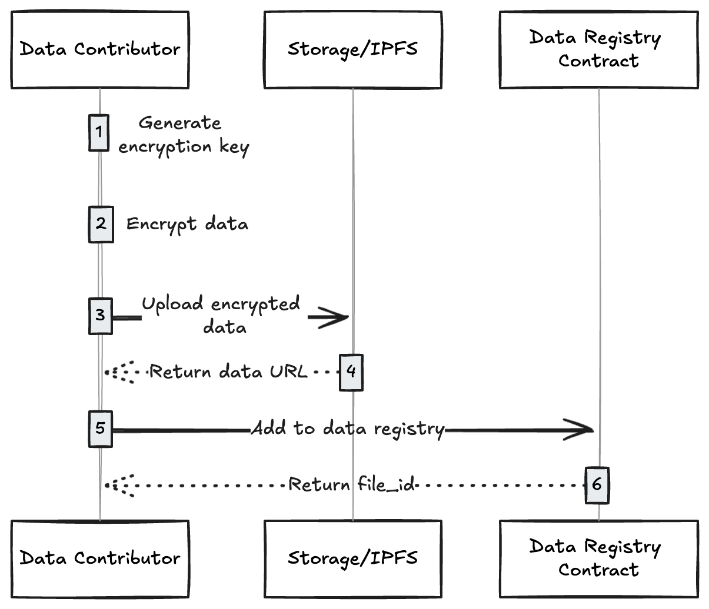

# Data Validation

Vana uses a [proof-of-contribution](../key-elements/proof-of-contribution/ "mention")system to validate data submitted to the network. "Valid" means something different in each DLP, because different DLPs value data differently.

## Running Proof-of-Contribution in the Satya Network

The recommended way of validating data securely in the Vana Network is by using the Satya Network, a group of highly confidential nodes that run on special hardware. At a high level, the data contributor adds unverified data, and requests a proof-of-contribution job from the [satya-validators.md](../roles/satya-validators.md "mention") (and pay a small fee to have their data validated). Once validated, the Satya validator will write the proof on chain.

## Proof-of-Contribution Template

To run PoC in the Satya Network, a DLP builder must implement a simple proof-of-contribution function using this template.


PoC Template: [https://github.com/vana-com/vana-satya-proof-template](https://github.com/vana-com/vana-satya-proof-template)


The diagram below explains how this PoC template works.&#x20;

<figure><figcaption>
Proof-of-contribution running in a Satya node
</figcaption></figure>

1. The data contributor adds their encrypted data onchain, via the [Data Registry](../key-elements/smart-contracts.md#data-registry-contract).
2. They request a validation job, paying a small fee. Once a Satya node is available to run the job, they connect directly to the node, and send them the encryption key and the proof-of-contribution docker image that needs to run on the data to validate it.
3. The Satya node receives the key, and downloads the encrypted file, and decrypts it
4. The Satya node places the decrypted file in a temporary, shielded\* location. The node operator cannot see the contents of this location.
5. The Satya node downloads and initializes a docker container to run the specified proof-of-contribution, and mounts the input and output volumes. The PoC container will have access to the decrypted file.
6. The PoC container runs its validations on the decrypted data, and outputs the attestation. More information on data attestation can be found here: [data-attestation.md](data-attestation.md "mention").
7. The Satya node reads the output, and generates the proof.
8. The Satya node writes the proof onchain, and claims the fee as a reward for completing that work.


\* A [Gramine shielded container](https://gramine.readthedocs.io/projects/gsc/en/latest/) is a specialized type of container that leverages the Gramine library OS to run applications in a secure, isolated environment, typically utilizing hardware-based trusted execution environments (TEEs) like Intel SGX.


## Satya Network Integration

Once a data contributor has uploaded their encrypted file to the [Data Registry](../key-elements/smart-contracts.md#data-registry-contract), it's time to run a proof of contribution job to validate it. The steps below show how to use the Satya Network to validate it.&#x20;

<figure><figcaption>
Using a Satya node to run proof-of-contribution
</figcaption></figure>

1. Each validation job requires a small fee (which changes based on load). The data contributor can get the current fee by calling `teeFee()` on the [#tee-pool-contract](../key-elements/smart-contracts.md#tee-pool-contract "mention").&#x20;
2. The current job fee is returned: ex: `job_fee = 3 VANA`
3. The DLP UI now attaches a listener to listen for `JobSubmitted` events from the TEE Pool contract, which emits when the job is successfully submitted.
4. The DLP UI submits the job request to the TEE Pool to get the data contributor's file validated: `requestContributionProof(file_id, { value: job_fee })`
5. The TEE Pool assigns a Satya node to handle the job, and the `JobSubmitted` event is fired
6. The DLP UI receives the `JobSubmitted` event, and gets the corresponding `job_id`
7. The DLP UI gets the details of the Satya node assigned to the job by calling the TEE Pool's `jobTee(job_id)`
8. The TEE Pool returns the address of a Satya node, so the UI can connect to it directly: ex: `https://satya-1.com`
9.  The DLP UI sends the following request to the Satya node to begin the validation. It includes the encryption key used by the Satya node to decrypt the file, along with the URL of the proof-of-contribution docker image that will be run to generate the attestation.

    <pre class="language-json"><code class="lang-json">POST https://satya-1.com/RunProof 
    <strong>{ 
    </strong>    file_id: 123, // File ID from the Data Registry
        job_id: 456,  // Job ID sent by the JobSubmitted event
        encryption_key: "0x1234..", // The symmetric key used to decrypt the file
        proof_url: "https://github.com/vana-com/vana-satya-proof-template/releases/download/v22/gsc-my-proof-22.tar.gz", // The proof-of-contribution docker image URL
        encryption_seed: "Please sign to retrieve your encryption key", // The message that was signed to generate the encryption_key
        env_vars: { // Any environment variables that get passed into the proof-of-contribution container
            key: "value"
        }
    }
    </code></pre>
10. The Satya node downloads the encrypted data, decrypts it, and spins up the proof-of-contribution container, which validates the data and generates a result. It then builds the attestation according to the [data-attestation.md](data-attestation.md "mention") schema, and the proof is uploaded to IPFS.
11. The Satya node sends the proof to the TEE Pool
12. The TEE Pool contract verifies the proof
13. The TEE Pool adds the proof to the data registry
14. The Satya node claims the `job_fee` for completing the job
15. The TEE Pool releases the `job_fee`


The Satya Network is a work in progress. It is subject to change, and may be unstable at this time. Do not send sensitive information to the Satya nodes while in testnet.


