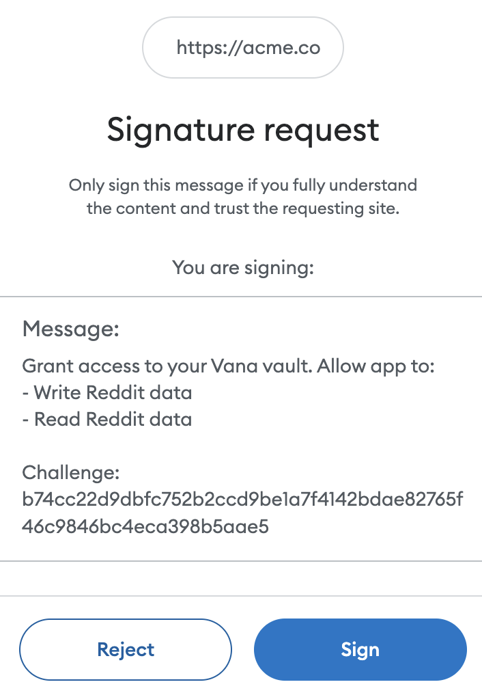
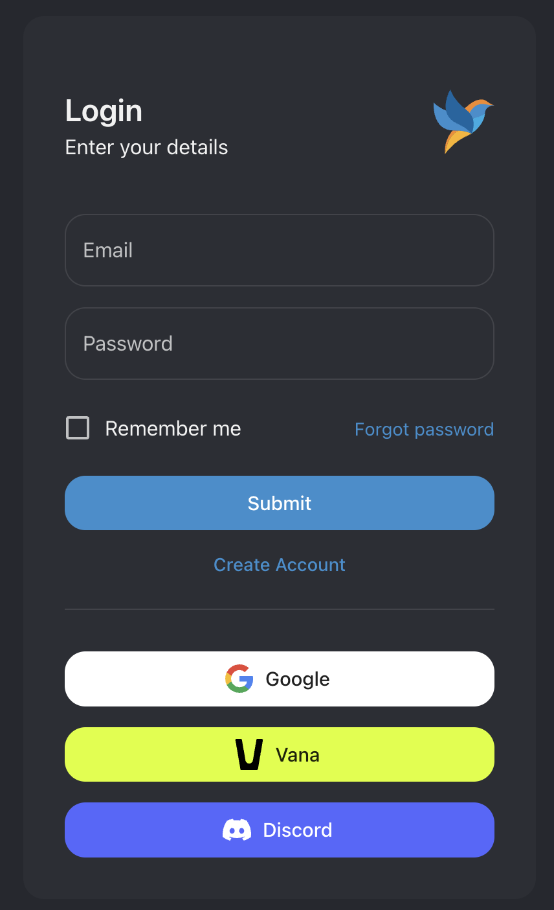

# Data and Model Portability

With Vana, you can bring your own models and private data across applications. You can also use any models or data on collective servers that you have access to.

For example, here is the OAuth screen for [Chirper AI](https://chirper.ai/). By logging in with Vana, you can bring your models and data to the application. If you prefer, you can authenticate using a crypto wallet (experimental). You choose the level of access to grant the application. You can grant access to only inference of your personal model, keeping the underlying data private, or you can grant full access to allow the app to have a copy of your data.

<figure><figcaption>
Wallet Sign In (experimental)
</figcaption></figure>

<figure><figcaption></figcaption></figure>

If you are a developer who would like to add support for Vana in your application, please see the [API Integration docs](https://docs.vana.org/api) for detailed steps.

[\
](https://docs.vana.com/network/on-chain-incentives/model-specific-tokens)
